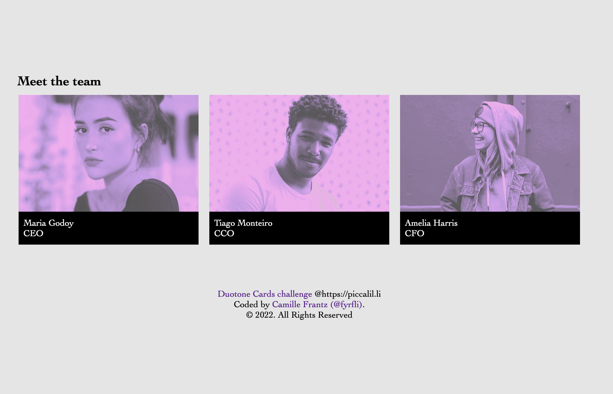
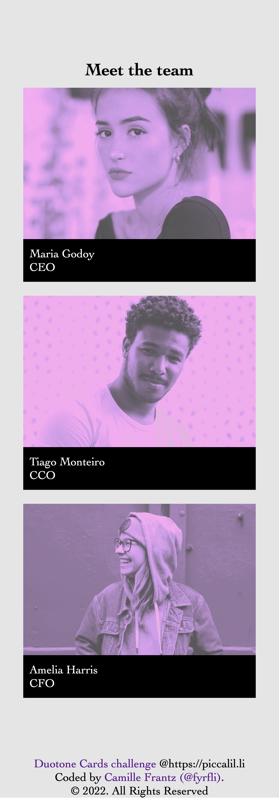

# Duotone Card Challenge

This is a challenge from [Piccalilli](https://piccalil.li/blog/challenge-003-duotone-card/) to build out a card layout introducing staff members of a company.

The challenge is to tint the images and show their true tones on hover.

~~I am having trouble with the tinting... no surprise there.~~

I did it - complete with transitions! Yay!

Of course, I didn't quite do it the way the author did it and that is my next challenge. Understanding how they did it and reproduce that as a second attempt.

---

## Desktop Screenshot

## Mobile Screenshot

